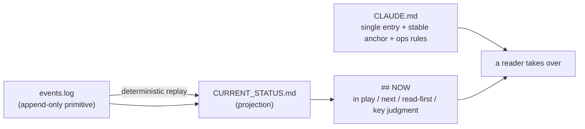

# Doc Harness &nbsp;·&nbsp; v2.0.0

[中文版 README](README_zh.md) · [Specification](DOC_HARNESS_SPEC.md) · [Philosophy](PHILOSOPHY.md)

**Document-based project control for work with AI agents.**

Doc Harness is a skill that makes a long-running project **resumable from its files alone**. Sessions end, context windows compact, a different agent arrives with zero memory — reading the project's own documents is still enough to take over correctly.

No database, no MCP server, no external memory. Plain Markdown, plus an optional PowerShell toolbelt that makes the mechanical parts falsifiable.



---

## Who it's for, and a 5-minute trial

**For:** anyone who runs a project across many AI sessions — research, code, documents, analysis — and has felt the tax of *"where were we, and which of these notes actually matters right now?"* Also for anyone who wants an agent's judgment to survive a context reset instead of evaporating with it.

**Try it in five minutes:**

1. `git clone https://github.com/cilidinezy-commits/doc-harness.git`, then copy `skill/` into your agent's skills directory (or install the plugin above).
2. In a project of yours, say: *"Set up doc-harness for this project."* It asks three things — what the project is, where you are now, what's next — and writes the documents around your real state.
3. Work normally. When you stop, say: *"flush the doc state."*
4. Start a **new session** and say: *"resume."* Watch it reconstruct where you were from files instead of asking you.
5. Optional, if you want to see the engineering: `powershell -File tools/conformance.ps1 -ProjectRoot . -Full` runs every guard on your own documents, including the handoff regression test.

---

## The one question it answers

> Sessions end. Context is lost. **What is the minimal, trustworthy representation of a project's state, such that a new agent can correctly take over?**

Everything in Doc Harness is derived from that question — including what it deliberately does **not** do: it never tells an agent *how* to work. It records what is, what was decided, and what comes next; it does not prescribe methods, tooling, or thinking styles.

The first principle is **handoff over writing**: writing is the means, correct takeover is the end. Not written = lost. Written but unreachable from the entry = effectively lost.

---

## Why the obvious approach fails

"Just write things down" is not enough. Real long-running projects show three distinct failures, and they need three distinct answers:

| Failure | Sounds like | Doc Harness's answer |
|---------|-------------|---------------------|
| **Written ≠ used** | "It's all in the docs, and the agent still repeated the same mistake" | A discipline that can be checked by a machine becomes a **guard** (something turns red), not another paragraph |
| **Used ≠ true** | "The doc says X, but X stopped being true three weeks ago" | Every claim carries a **source and a class**; standing conclusions carry an expiry; the state file is *generated*, so it cannot drift from the log |
| **Written ≠ findable** | "We documented this last month — where?" | A minimal entry chain (`CLAUDE.md` → `## NOW` → read-first) plus a layered search that names its layers |

The design consequence: **the state must be a projection, not a document.** If state is a file people edit by hand, it will drift. If state is derived from an append-only log by a deterministic replay, drift becomes mechanically detectable.

---

## How it works

### 1. `events.log` — the primitive

One line per state change, append-only:

```
2026-06-02 plan:set 调研 | 设计 | 实施
2026-06-02 unit:open C/出口对账 对齐报关行的字段口径
2026-06-03 unit:activate C/出口对账
2026-06-05 unit:close C/出口对账 evidence=notes/2026-06-05-对账.md class=root
2026-06-05 next:set 复核 3 月异常单 blocker=等待业务方确认
2026-06-05 judgment:set 口径以报关行回执为准 source=notes/2026-06-05-对账.md class=decision
2026-06-06 dead-end:set 用对账单反推口径：账单本身有 3 天延迟，反推必然错位
```

Verbs: `unit:open / unit:activate / unit:close / unit:pause`, `next:set`, `judgment:set`, `read-first:set`, `plan:set`, `dead-end:set`, `note:set`. A line starting with `#` is a comment.

Two details that matter: a unit id may be **hierarchical** (`C/出口对账` groups under part `C`, for free), and closing a unit **requires evidence with a provenance class** (`evidence=<path> class=root|decision|reported`). Recording state costs one line — which is why "I'll write it later" is never an excuse.

### 2. `CURRENT_STATUS.md` — the projection

Generated from the log, **never hand-edited**:

```markdown
## NOW

- **Active**: C/出口对账
- **Next**: 复核 3 月异常单 — blocker: 等待业务方确认
- **Read-first**: notes/2026-06-05-对账.md, CLAUDE.md
- **Key-judgment**: 口径以报关行回执为准 source=notes/2026-06-05-对账.md class=decision
- **Refreshed**: 2026-06-05
```

Below `## NOW` sit the **work surface** (plan + units with `[active]/[future]/[done]/[paused]`), recent history, a housekeeping notes section, and a **negative ledger** of dead ends. The work surface is a *surface*, not a linear phase list: projects branch, jump between parts, reorganize, and open new parts — a "phase 1 → 2 → 3" timeline cannot describe that, and pretending otherwise is how state files lie.

### 3. `CLAUDE.md` — the single entry

Identity lock → stable anchor (framework anchor, iron rules, bottom-line principles) → recovery chain → the operational rules embedded between sentinels. `AGENTS.md`, if present, is a **thin pointer** to it, never a second copy of the truth. (Two divergent entry files are a bug factory in harnesses that read both.)

### 4. The toolbelt — making the mechanical parts falsifiable

Optional PowerShell tools, all reading one shared parser. The important ones:

| Tool | What it protects |
|------|------------------|
| `record.ps1` | One command per state change: append, re-project, re-check (`-EventsFile` records a batch) |
| `project.ps1` | Deterministic replay → `CURRENT_STATUS.md` |
| `conformance.ps1` | The whole gate in one command: projection freshness, ops/spec version drift, and every guard below (`-Full` adds the handoff regression test) |
| `now-verify.ps1` | `## NOW` is bounded, valid UTF-8, actionable — **and no project file changed after the last recorded event** (work that was never recorded turns red) |
| `unregistered.ps1` | No file exists outside the index (an unregistered file is invisible = lost) |
| `dead-pointer.ps1` | Every path the documents name still exists |
| `cite-check.ps1` | Every judgment and closed unit carries a source + provenance class |
| `stale-check.ps1` | Standing conclusions carry `conclusion_until` and go red when expired |
| `encoding-guard.ps1` | Status files are valid UTF-8; tool scripts stay ASCII (PowerShell 5.1 reads BOM-less scripts as ANSI) |
| `recurrence.ps1` | A discipline restated ≥3 times but never made into a guard |
| `skill-consistency.ps1` | The English and Chinese skills cannot drift apart structurally, and no doc may quietly teach the retired v1 model again |
| `entry-check.ps1` | One entry, not two: `AGENTS.md` may not grow into a second copy of the state |
| `handoff-test.ps1` | The mechanism itself: builds a deliberately non-linear fixture and asserts the projection, frontier, evidence, and that the guards go red on broken input |
| `log-migrate.ps1` / `ops-embed.ps1` | Adopting a new schema or re-embedding the ops block without hand-editing |
| `mail-send.ps1` / `mail-poll.ps1` / `mail-daemon.ps1` | Cross-project coordination: one-step send, wake-only poll, or a complete background daemon (idle = pure sleep, no LLM) |
| `search.ps1` | Layered search (`all / now / history / files / anchor`) instead of re-reading everything |

---

## Install

Doc Harness is plain Markdown, so it works with **any agent that can read files**. Pick the path that matches your tool.

### Claude Code — plugin marketplace

```
/plugin marketplace add cilidinezy-commits/doc-harness
/plugin install doc-harness@doc-harness        # English
# or: /plugin install doc-harness-zh@doc-harness   (中文版)
```

Install one language, not both — they expose the same `/doc-harness` command.

### Any agent — manual copy

```bash
git clone https://github.com/cilidinezy-commits/doc-harness.git
```

Then copy the skill folder into your agent's skills directory:

| Agent | Copy `skill/` (or `skill-zh/`) to |
|-------|-----------------------------------|
| Claude Code | `~/.claude/skills/doc-harness/` |
| Codex | `~/.agents/skills/doc-harness/` (or a project's `.agents/skills/`) |
| Anything else | wherever it discovers skills — or simply tell the agent to read `skill/SKILL.md` |

Install inside a single project instead if you want to pin a version per project.

### Verify

```bash
head -3 ~/.claude/skills/doc-harness/spec.md     # → **Version**: v2.0.0
```

In an agent session, `/doc-harness` (or "check this project's doc health") should produce the command help.

---

## Use

| Command | Use it when | What happens |
|---------|-------------|--------------|
| `/doc-harness init` | Starting a project, or adopting one already underway | Creates the documents and reconstructs your real current state — not a blank slate |
| `/doc-harness check` | Routine maintenance; something feels messy | Audits health **and** reflects: is anything important only in context? |
| `/doc-harness sync` | Docs fell behind reality | Repairs drift: registers files, records missing unit events, refreshes the projection |
| `/doc-harness flush` | Context is about to compact | Mandatory inventory of context → write, register, verify — then refresh `## NOW` |
| `/doc-harness resume` | Empty context; new agent; "where were we?" | Executes the recovery chain, reports state, verifies understanding before continuing |
| `/doc-harness recall` | "Why did we decide X?" | Layered, cited retrieval across the documents |

Day to day you don't need commands — the operational rules are embedded in the project's `CLAUDE.md`, so the agent already knows. With the toolbelt installed, recording state is literally:

```powershell
powershell -File tools/record.ps1 -ProjectRoot . -Verb close -Text "C/出口对账 evidence=notes/2026-06-05-对账.md class=root"
```

---

## Adopting an existing project

Point `/doc-harness init` at a project that is already mid-flight: it reconstructs a faithful draft `events.log` from your real history, bulk-registers existing files, and asks you to confirm. Nothing is invented; unknown facts stay visibly unknown.

Upgrading a project that used an older schema is likewise one command (`tools/log-migrate.ps1`): it archives the pre-migration log as evidence, normalizes the events, leaves a comment trail inside the log, and re-projects — verified so the projection is unchanged.

---

## Does it actually hold up?

Three kinds of evidence, all reproducible from this repo:

1. **The mechanism is regression-tested.** `tools/handoff-test.ps1` builds a deliberately awkward fixture (two parts, interleaved open/activate/close, a paused unit, a dead end, a housekeeping note) and asserts 24 properties of the projection — and that the guards *go red* on broken input. A guard that never fires is decoration.
2. **The repo passes its own gate.** This repository is managed by Doc Harness; `powershell -File tools/conformance.ps1 -ProjectRoot . -Full` is green, including projection freshness, dead pointers, provenance classes and encoding.
3. **It has been used on real projects for months** — including a very large, documentation-heavy one, where the failure mode that motivated v2 appeared: *reading the docs was not the problem; knowing which of thousands of lines mattered right now was.* The v2 redesign (projection instead of prose, `## NOW` instead of a status file, guards instead of reminders) came out of that field feedback and several rounds of adversarial review by agents working on those projects. Their letters are development correspondence and are not part of this published tree.

---

## Design philosophy

The short version, with the full text in [PHILOSOPHY.md](PHILOSOPHY.md) and normative detail in [the spec](DOC_HARNESS_SPEC.md):

- **Every discipline declares its placement.** Can a machine see it? Then it is a **gate** (it turns something red). Can it be verified in principle but not instrumented? Then it is a **named blind spot** — the only way its absence becomes visible. Can't be a gate but must be present every session? Then it lives at the **top of `CLAUDE.md`**, short enough to actually be read. Only then comes **queryable**, which is an explicit admission that it may be lost.
- **Never hand-copy a list that must stay in sync.** Enumerate it from the source, and verify that everything it names still exists.
- **A conclusion is not immortal.** Standing claims carry an expiry and a way to re-verify them.
- **Second restatement is a signal.** A rule that keeps being restated should become a guard — or be marked as *deliberately* only queryable.
- **Guards must be actionably red.** A guard that fires on a healthy project destroys trust in every other guard.
- **Record, don't coach.** Doc Harness is process information; it has no opinion about how you work.

---

## Repository layout

```
skill/                English skill: SKILL.md + init/check/sync/flush/recall/resume + spec + ops rules
skill-zh/             中文版（与 skill/ 一一对应）
tools/                Optional deterministic toolbelt (PowerShell) — see tools/README.md
CLAUDE.md             This project's own entry (Doc Harness manages itself)
CURRENT_STATUS.md     Generated projection — do not hand-edit
events.log            This project's event log
FILE_INDEX.md         Catalog of every file in this repo
_validation/          Fixture projects used by the regression test (demo / trial / adversarial)
notes/                Design notes, analyses, and the verification log
PHILOSOPHY.md         Principles, with the practice that forged each one
DOC_HARNESS_SPEC.md   Complete specification (normative)
kimi-skill/           Legacy Kimi CLI variant, archived (not maintained)
```

Two documents deserve a look if you want to judge the engineering rather than the pitch: [`notes/state-model.md`](notes/state-model.md) (why state must be a projection) and [`notes/validation.md`](notes/validation.md) (what has been verified, what failed, and what is still unverified).

---

## FAQ

**How is this different from just using `CLAUDE.md` / `AGENTS.md`?**
A `CLAUDE.md` is one file that answers "what is this project". It does not answer "what is in play right now", and it drifts as a project moves. Doc Harness separates the unchanging (anchor) from the changing (projection), makes the changing *generated* rather than edited, and adds the guards that keep both honest. If your `CLAUDE.md` keeps growing past a few hundred lines, or an agent re-reads it to figure out "what are we actually doing right now", that is the signal.

**Which agents does it work with?**
Any that can read files. The command names are a Claude Code convention; everything else — the document model, the guards, the tools — is agent-agnostic. The toolbelt is plain PowerShell so the same checks run under any harness or in a human's shell.

**What happens at the moment context is lost?**
That is the design target. A fresh reader goes `CLAUDE.md` → `## NOW` → the two-to-four files named there, and can state: what is in play, the single next action and its blocker, the most recent decision that reorients work, and which unit closed last with what evidence. `resume` makes that explicit and verifiable rather than hopeful.

**Is there lock-in?**
None. Everything is plain Markdown; the toolbelt is optional. Delete the status files and your project is untouched.

**What keeps the documents honest?**
Generating the state file from a log (drift is detectable), requiring evidence with a provenance class on every closure, the freshness check that reddens unrecorded work, the dead-pointer check that reddens references to things that no longer exist, and the habit of turning repeated mistakes into guards instead of reminders.

**Can I customize it?**
Yes. Projects choose their own iron rules, parts, unit ids and categories. The invariants are few: one entry file, state generated from the log, files registered, closures carry evidence.

**What's in v2 that wasn't in v1?**
v1 was a five-document model with a hand-maintained status file and a prose worklog; v2 makes state a projection from an append-only event log, replaces the linear phase with a work surface, adds the placement/falsifiability/provenance rules, and ships the guard toolbelt. Version history and migration notes: [spec §14](DOC_HARNESS_SPEC.md).

**Does the toolbelt require PowerShell?**
Only the toolbelt does. The document system itself is language- and tool-agnostic; the guards are conveniences that keep the mechanical parts honest.

---

## Requirements

- Any AI coding agent (Claude Code, Codex, or anything that reads files) — or a human with a text editor
- No dependencies for the document system itself
- PowerShell (5.1+) only if you want the optional toolbelt

## License

[MIT](LICENSE)

## Credits

Designed and built through iterative human–AI collaboration: sustained use on real projects, several rounds of adversarial review by independent agent sessions, and a habit of turning every repeated mistake into a guard.
