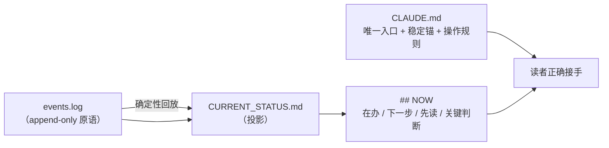

# Doc Harness &nbsp;·&nbsp; v2.0.0

[English README](README.md) · [规范全文](DOC_HARNESS_SPEC.md) · [哲学](PHILOSOPHY.md)

**给「与 AI 协作的长期项目」的文档化项目控制。**

Doc Harness 是一套 skill：让一个长期项目**仅凭它自己的文件就能被正确接手**。session 会结束、context 会压缩、会有零记忆的新 agent 到来——但只要读到项目自己的文档，接手就是正确的。

没有数据库、没有 MCP、没有外部记忆。全是最普通的 Markdown；另有一套可选的 PowerShell 工具带，把机械的部分变成**可反证**的东西。



---

## 它是给谁用的，以及 5 分钟试用

**给谁：** 任何跨多个 AI 会话推进一个项目的人——研究、代码、文档、分析——并且体会过那种「上次做到哪？这一堆笔记里哪条此刻要紧？」的税。也适合那些希望 agent 的判断能挺过一次 context 重置、而不是随之蒸发的人。

**五分钟试一遍：**

1. `git clone https://github.com/cilidinezy-commits/doc-harness.git`，把 `skill-zh/`（或 `skill/`）复制进你的 agent 的 skills 目录（或按上面的插件方式安装）。
2. 在你自己的项目里说：*「用 doc-harness 把这个项目管起来」*。它只问三件事——项目是什么、现在到哪一步、下一步做什么——然后围绕你真实的状态写文档。
3. 照常工作。停下来时说：*「把文档状态冲刷一下」*。
4. **开一个新会话**，说：*「恢复」*。看它凭文件把你上次的位置重建出来，而不是反问你。
5. 可选，如果你想看工程实现：`powershell -File tools/conformance.ps1 -ProjectRoot . -Full` 会在你自己的文档上跑全部守卫，包括接手回归测试。

---

## 它回答的唯一问题

> session 会结束，context 会丢。**一个项目状态的「最小且可信」的表示是什么，才能让一个新 agent 正确接手？**

Doc Harness 的一切都由这个问题推导而来——包括它**刻意不做**的事：它从不告诉 agent「该怎么工作」。它记录事实、决定与下一步，不规定方法、工具或思维方式。

首要原则是**接手优先于记录**：写是手段，正确接手才是目的。不写＝丢失；写了但从入口找不到＝等同丢失。

---

## 为什么「多写文档」不够

真实的长项目会暴露三种**不同**的失败，需要三种不同的答案：

| 失败 | 听起来像 | Doc Harness 的答案 |
|------|---------|-------------------|
| **写了 ≠ 被用** | 「都在文档里，agent 还是犯了同一个错」 | 能被机器检验的纪律就做成**守卫**（会变红），而不是再写一段话 |
| **用了 ≠ 是真的** | 「文档里说 X，但三周前 X 就不再成立了」 | 每条声明带**来源与 class**；常设结论带时效；状态文件是**生成的**，无法相对日志漂移 |
| **写了 ≠ 找得到** | 「上个月记过——在哪儿？」 | 最小入口链（`CLAUDE.md` → `## NOW` → 先读）＋会报出自己层级的检索 |

由此得到的设计结论：**状态必须是一个投影，而不是一份文档。** 靠人手维护的状态文件一定会漂移；而由 append-only 日志经确定性回放导出的状态，漂移变成机器可测的事。

---

## 它怎么工作

### 1. `events.log`——原语

一行一次状态变更，只增不改：

```
2026-06-02 plan:set 调研 | 设计 | 实施
2026-06-02 unit:open C/出口对账 对齐报关行的字段口径
2026-06-03 unit:activate C/出口对账
2026-06-05 unit:close C/出口对账 evidence=notes/2026-06-05-对账.md class=root
2026-06-05 next:set 复核 3 月异常单 blocker=等待业务方确认
2026-06-05 judgment:set 口径以报关行回执为准 source=notes/2026-06-05-对账.md class=decision
2026-06-06 dead-end:set 用对账单反推口径：账单本身有 3 天延迟，反推必然错位
```

动词：`unit:open / unit:activate / unit:close / unit:pause`、`next:set`、`judgment:set`、`read-first:set`、`plan:set`、`dead-end:set`、`note:set`。以 `#` 开头的行是注释。

两个要紧的细节：unit id 可以是**分层的**（`C/出口对账` 会白拿一个 `C` 部分的分组）；收口**必须带证据与溯源 class**（`evidence=<路径> class=root|decision|reported`）。记录状态的代价是一行——所以「等会儿再写」永远不是理由。

### 2. `CURRENT_STATUS.md`——投影

由日志生成，**绝不手改**：

```markdown
## NOW

- **Active**: C/出口对账
- **Next**: 复核 3 月异常单 — blocker: 等待业务方确认
- **Read-first**: notes/2026-06-05-对账.md, CLAUDE.md
- **Key-judgment**: 口径以报关行回执为准 source=notes/2026-06-05-对账.md class=decision
- **Refreshed**: 2026-06-05
```

`## NOW` 之下是**活跃工作面**（规划 + 单元，标 `[active]/[future]/[done]/[paused]`）、近期历史、杂务记录区，以及一张**否定台账**（走过的死路）。工作面是一张**面**，不是线性阶段表：项目会分叉、会跳、会重组、会长出新部分——「阶段 1 → 2 → 3」描述不了这些，而假装能描述，正是状态文件开始说谎的方式。

### 3. `CLAUDE.md`——唯一入口

身份锁 → 稳定锚（框架锚、铁律、底层原则）→ 恢复链 → 嵌在两个哨兵之间的操作规则。若存在 `AGENTS.md`，它只是**薄指针**，绝不是第二份真理。（两份分叉的入口文件，在会同时读两者的 harness 里就是 bug 工厂。）

### 4. 工具带——让机械的部分可反证

可选 PowerShell 工具，全部共用同一个解析器。要紧的几个：

| 工具 | 它保护什么 |
|------|-----------|
| `record.ps1` | 一次状态变更一条命令：追加、重投影、重检（`-EventsFile` 可一次记一批） |
| `project.ps1` | 确定性回放 → `CURRENT_STATUS.md` |
| `conformance.ps1` | 单一闸门：投影新鲜度、ops/spec 版本漂移，以及下列所有守卫（`-Full` 再加上接手回归测试） |
| `now-verify.ps1` | `## NOW` 有界、有效 UTF-8、可执行——**且最后一条事件之后没有任何项目文件被改动**（未记录的工作会红） |
| `unregistered.ps1` | 没有文件游离在索引之外（未注册＝不可见＝丢失） |
| `dead-pointer.ps1` | 文档指名的每个路径都还存在 |
| `cite-check.ps1` | 每条判断与收口都带来源与溯源 class |
| `stale-check.ps1` | 常设结论带 `conclusion_until`，过期即红 |
| `encoding-guard.ps1` | 状态文件是有效 UTF-8；工具脚本保持纯 ASCII（PowerShell 5.1 会按 ANSI 读无 BOM 脚本） |
| `recurrence.ps1` | 被重申 ≥3 次却始终没变成守卫的纪律 |
| `skill-consistency.ps1` | 中英两版不能结构性地漂开，也不允许任何文档悄悄重新教回已被淘汰的 v1 模型 |
| `entry-check.ps1` | 入口只能有一个：`AGENTS.md` 不许长成第二份状态副本 |
| `handoff-test.ps1` | 机制本身：造一个刻意非线性的夹具，断言投影、前沿、证据，以及**守卫在坏输入上确实会红** |
| `log-migrate.ps1` / `ops-embed.ps1` | 采纳新 schema、重新嵌入 ops 块——不必手改 |
| `mail-send.ps1` / `mail-poll.ps1` / `mail-daemon.ps1` | 跨项目协作：一步发信、只唤醒的轮询，或完备后台守护（空闲即纯睡眠、不耗 LLM） |
| `search.ps1` | 分层检索（`all / now / history / files / anchor`），而不是把所有东西重读一遍 |

---

## 安装

Doc Harness 就是 Markdown，**任何能读文件的 agent** 都能用。按你的工具选一条路。

### Claude Code——插件市场

```
/plugin marketplace add cilidinezy-commits/doc-harness
/plugin install doc-harness@doc-harness        # 英文
# 或：/plugin install doc-harness-zh@doc-harness   （中文版）
```

只装一种语言——它们暴露同一个 `/doc-harness` 命令。

### 任何 agent——手工复制

```bash
git clone https://github.com/cilidinezy-commits/doc-harness.git
```

然后把 skill 目录复制到你的 agent 的 skills 目录：

| Agent | 把 `skill/`（或 `skill-zh/`）复制到 |
|-------|-----------------------------------|
| Claude Code | `~/.claude/skills/doc-harness/` |
| Kimi CLI | `~/.kimi/skills/doc-harness/` |
| Codex | `~/.agents/skills/doc-harness/`（或项目的 `.agents/skills/`） |
| 其他 | 它发现 skill 的地方——或者干脆让 agent 去读 `skill/SKILL.md` |

**同一个 skill 目录服务全部 agent，不存在需要分别维护的分支。** Kimi CLI 的发现规则（官方文档）
会看 `~/.kimi/skills/`、`~/.claude/skills/`、`~/.codex/skills/`，默认**合并**，同名 skill 按
`kimi > claude > codex` 取优先级——装进任意一个即可，已有的 Claude Code 安装会被自动发现。
细节与出处见 [`notes/kimi-claude-interop.md`](notes/kimi-claude-interop.md)。

想让某个项目锁定自己的版本，就装到那个项目里。

### 验证

```bash
head -3 ~/.claude/skills/doc-harness/spec.md     # → **Version**: v2.0.0
```

在 agent 会话里输入 `/doc-harness`（或者说「检查这个项目的文档健康」），应看到命令帮助。

---

## 使用

| 命令 | 什么时候用 | 会发生什么 |
|------|-----------|-----------|
| `/doc-harness init` | 新建项目，或中途采纳已有项目 | 建文档，并**重建你真实的当前状态**——不是一张白纸 |
| `/doc-harness check` | 例行维护；感觉有点乱 | 审计健康度**并**反思：有没有重要信息只存在于 context？ |
| `/doc-harness sync` | 文档落后于现实 | 修漂移：注册文件、补记单元事件、刷新投影 |
| `/doc-harness flush` | context 即将压缩 | 强制盘点 context → 写入、注册、验证 —— 最后刷新 `## NOW` |
| `/doc-harness resume` | context 为空；新 agent；「上次做到哪」 | 执行恢复链、给出状态报告、先验证理解再继续 |
| `/doc-harness recall` | 「当初为什么决定 X？」 | 跨文档的分层、带引用检索 |

日常你不需要记命令——操作规则嵌在项目的 `CLAUDE.md` 里，agent 已经知道。装了工具带之后，记录状态就是：

```powershell
powershell -File tools/record.ps1 -ProjectRoot . -Verb close -Text "C/出口对账 evidence=notes/2026-06-05-对账.md class=root"
```

---

## 采纳一个已经在跑的项目

把 `/doc-harness init` 指向一个已经进行中的项目：它会从你的真实历史中重建一份忠实的 `events.log` 草稿、批量注册已有文件，然后请你确认。它不发明事实；不知道的就明确留成不知道。

升级一个用过旧 schema 的项目同样是一条命令（`tools/log-migrate.ps1`）：把迁移前的日志归档为证据、规范化事件、在日志里留下注释轨迹、再重投影——并经过验证，投影不变。

---

## 它真的靠得住吗

三类证据，都能在本仓库里复现：

1. **机制有回归测试。** `tools/handoff-test.ps1` 造了一个刻意别扭的夹具（两个部分、交错的 open/activate/close、一个挂起单元、一条死路、一条杂务记录），断言投影的 24 条性质——以及**守卫在坏输入上确实会红**。从不报警的守卫只是装饰。
2. **本仓库通过它自己的闸门。** 这个仓库就是被 Doc Harness 管理的；`powershell -File tools/conformance.ps1 -ProjectRoot . -Full` 全绿，包括投影新鲜度、死指针、溯源 class 与编码检查。
3. **它已经在真实项目上用了几个月**——包括一个规模很大、文档很重的项目，而正是那里的现场反馈催生了 v2：*问题不在于读不到文档，而在于无法判断成千上万行里此刻哪几行要紧。* v2 的重设计（投影取代散文、`## NOW` 取代状态文件、守卫取代提醒）来自那些反馈，以及那些项目的 agent 多轮对抗式评审。那些往来信件属于开发过程通信，不在本发布树内。

---

## 设计哲学

简短版如下，全文见 [PHILOSOPHY.md](PHILOSOPHY.md)，规范细节见[规范全文](DOC_HARNESS_SPEC.md)：

- **每条纪律都要声明自己的放置。** 机器看得见吗？看得见就做成**守卫**（会变红）。原则上可验但没有量具？那是一个**有名有姓的盲区**——这是它「缺席」唯一可见的方式。变不成守卫但每次都必须在场？那就住在 **`CLAUDE.md` 顶部**，短到真的能被读完。最后才是**可查**，而那等于明确承认：它可能会丢。
- **绝不手抄一份必须保持同步的名单。** 从源枚举，并验证它指名的每样东西都还在。
- **结论不是不朽的。** 常设声明带失效日期和重新验证的方式。
- **第二次重申就是信号。** 一条反复重申的规则应该变成守卫——或者被明确标注为*刻意*只放在可查层。
- **守卫必须红得可行动。** 一个在健康项目上误报的守卫，会摧毁对所有其它守卫的信任。
- **记录，不教练。** Doc Harness 是过程信息；它对你的工作方式没有意见。

---

## 仓库结构

```
skill/                英文 skill：SKILL.md + init/check/sync/flush/recall/resume + 规范 + 操作规则
skill-zh/             中文版（与 skill/ 一一对应）
tools/                可选的确定性工具带（PowerShell）——见 tools/README.md
CLAUDE.md             本项目自己的入口（Doc Harness 管理它自己）
CURRENT_STATUS.md     生成的投影——不要手改
events.log            本项目的事件日志
FILE_INDEX.md         本仓库每个文件的索引
_validation/          回归测试用的夹具项目（demo / trial / adversarial）
notes/                设计笔记、分析与验证记录
PHILOSOPHY.md         原则，以及锻造出每条原则的实践
DOC_HARNESS_SPEC.md   完整规范（规范性）
```

同一个 skill 目录服务全部 agent（Claude Code、Kimi CLI、Codex），不存在分别维护的分支。

```
skill/                英文 skill：SKILL.md + init/check/sync/flush/recall/resume + 规范 + 操作规则
skill-zh/             中文版（与 skill/ 一一对应）
tools/                可选的确定性工具带（PowerShell）——见 tools/README.md
CLAUDE.md             本项目自己的入口（Doc Harness 管理它自己）
CURRENT_STATUS.md     生成的投影——不要手改
events.log            本项目的事件日志
FILE_INDEX.md         本仓库每个文件的索引
_validation/          回归测试用的夹具项目（demo / trial / adversarial）
notes/                设计笔记、分析与验证记录
PHILOSOPHY.md         原则，以及锻造出每条原则的实践
DOC_HARNESS_SPEC.md   完整规范（规范性）
kimi-skill/           早期 Kimi CLI 变体，已归档（不再维护）
```

如果你想判断的是工程质量而不是宣传，有两份文档值得看：[`notes/state-model.md`](notes/state-model.md)（为什么状态必须是投影）与 [`notes/validation.md`](notes/validation.md)（验证了什么、什么失败了、什么还没验证）。

---

## 常见问题

**这和直接用 `CLAUDE.md` / `AGENTS.md` 有什么不同？**
`CLAUDE.md` 是一份文件，回答「这个项目是什么」；它不回答「此刻在办什么」，也会随项目推进而漂移。Doc Harness 把不变的（锚）与变化的（投影）分开，让变化的**由工具生成**而不是手写，并加上让两者保持诚实的守卫。如果你的 `CLAUDE.md` 越写越长，或者 agent 总要把整份重读一遍才搞清楚「现在到底在做什么」，那就是升级信号。

**能配合哪些 agent？**
任何能读文件的都可以。命令名是 Claude Code 的习惯叫法；其余部分——文档模型、守卫、工具——与 agent 无关。工具带是纯 PowerShell，所以在任何 harness 里、甚至人的终端里跑的都是同一套检查。

**context 丢掉的那一刻会怎样？**
那正是设计目标。新读者按 `CLAUDE.md` → `## NOW` → 其中指名的 2–4 个文件读下去，就能说出：此刻在办什么、唯一的下一步及其障碍、最近一条改变方向的判断、最后收口的是哪个单元及其证据。`resume` 把这件事做得显式且可验证，而不是「但愿」。

**有锁定吗？**
没有。全是普通 Markdown，工具带是可选的。删掉状态文件，你的项目毫发无损。

**是什么让文档保持诚实？**
状态文件由日志生成（漂移可测）；每次收口必须带证据与溯源 class；时效检查会把未记录的工作标红；死指针检查会把「指名了已不存在的东西」标红；以及把重复犯的错变成守卫而不是提醒的习惯。

**能定制吗？**
能。项目自选铁律、部分、unit id 与分类。不变量很少：一个入口文件、状态由日志生成、文件要注册、收口要带证据。

**v2 比 v1 多了什么？**
v1 是五文档模型：手工维护状态文件 + 散文工作日志。v2 把状态变成 append-only 事件日志的投影，用活跃工作面取代线性阶段，加入放置/可反证/溯源规则，并附上守卫工具带。版本历史与迁移说明见[规范 §14](DOC_HARNESS_SPEC.md)。

**工具带必须用 PowerShell 吗？**
只有工具带需要。文档系统本身与语言、工具无关；守卫只是让机械部分保持诚实的便利设施。

---

## 环境要求

- 任何 AI 编码 agent（Claude Code、Codex，或任何能读文件的工具）——或者一个拿着文本编辑器的人
- 文档系统本身没有任何依赖
- 只有想用可选工具带时才需要 PowerShell（5.1+）

## 许可

[MIT](LICENSE)

## 致谢

通过持续的人机协作设计与构建：在真实项目上长期使用、由独立 agent 会话进行多轮对抗式评审，以及把每一个重复犯的错误都变成守卫的习惯。
